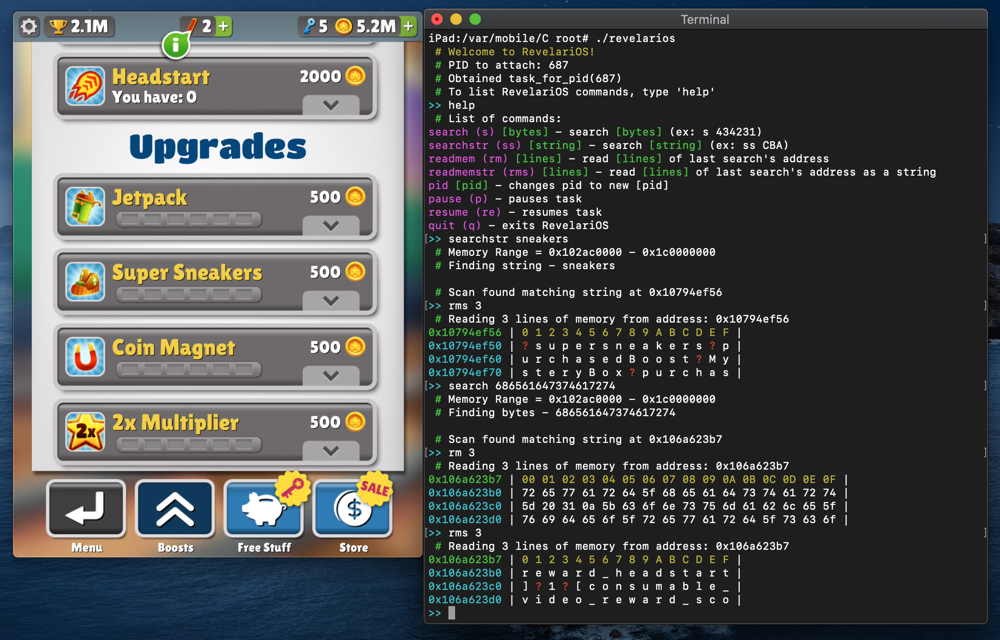

# RevelariOS - "To Reveal - for iOS"

RevelariOS is a CLI memory scanner meant for the average user. SearchKit (SearchKit/SearchKit.h) is also included for developers to use to add memory searching in their own projects.

## RevelariOS CLI Features:

- Search memory for instances of bytes in memory
- Search memory for instances of string in memory
- Print all found results
- Write bytes to memory
- Write string to memory
- Read lines of memory as bytes
- Read lines of memory as a chars
- Pause / Resume current task

Make sure to sign RevelariOS with ent.xml! RevelariOS can't operate without proper entitlements.

### Signing RevelariOS

Use `ldid` for signing RevelariOS. Exactly as typed and as root type `ldid -Sent.xml RevelariOS`

## Docs - searchkit.h

`kern_return_t get_region_size(mach_port_t task, vm_address_t *baseaddr, vm_address_t *endaddr)`
- Gets memory region for searching
- **mach_port_t task** - task for the process that will be searched
- **vm_address_t \*baseaddr** - base address found by get_region_size (out)
- **vm_address_t \*endaddr** - end address found by get_region_size (out)
- **RETURN** - KERN_SUCCESS / KERN_FAILURE

`search_t search_data(mach_port_t task, bool isString, vm_address_t baseaddr, vm_address_t end, vm_address_t *outaddr, char in[100])`
- Searches for the provided data
- **mach_port_t task** - task for the process that will be searched
- **bool isString** - boolean for wether the input data is bytes or simply a string
- **vm_address_t baseaddr** - base address for searching. Use `*baseaddr` from `get_region_size`
- **vm_address_t end** - base address for searching. Use `*endaddr` from `get_region_size`
- **vm_address_t  \*outaddr** - address where the searched data is found (out)
- **char in[100]** - the data to be searched. if `isString = true`, `search_data` will search for a string. The input string should be `"ABCDE"`. If `isString = false`, `search_data` will search for the provided bytes. The input bytes should be `"6269742e6c792f3368476634696d"`
- **RETURN** - SEARCH_SUCCESS / SEARCH_FAILURE / BYTES_UNEVEN / DATA_TOO_LARGE

`search_t write_data(mach_port_t task, bool isString, vm_address_t addr, char in[100])`
- **mach_port_t task** - task for the process that will be searched
- **bool isString** - boolean for wether the input data is bytes or simply a string
- **vm_address_t** - address to data at
- **char in[100]** - the data to be searched. if `isString = true`, `search_data` will search for a string. The input string should be `"ABCDE"`. If `isString = false`, `search_data` will search for the provided bytes. The input bytes should be `"6269742e6c792f3368476634696d"`
- **RETURN** - WRITE_SUCCESS / WRITE_FAILURE / BYTES_UNEVEN / DATA_TOO_LARGE

### CONSTANTS

`SEARCH_SUCCESS (0)` - search was successful

`SEARCH_FAILURE (1)` - search failed

`BYTES_UNEVEN (2)` - bytes attempted to be searched were uneven: ex: "41b". Use "410b" instead

`DATA_TOO_LARGE (3)` - input data is too large for allocated size (standard - 100)

`WRITE_SUCCESS (4)` - write was successfully

`WRITE_FAILURE (5)` - write failed

### Typedefs

`search_t (int)`

`byte_t (unsigned char)`
